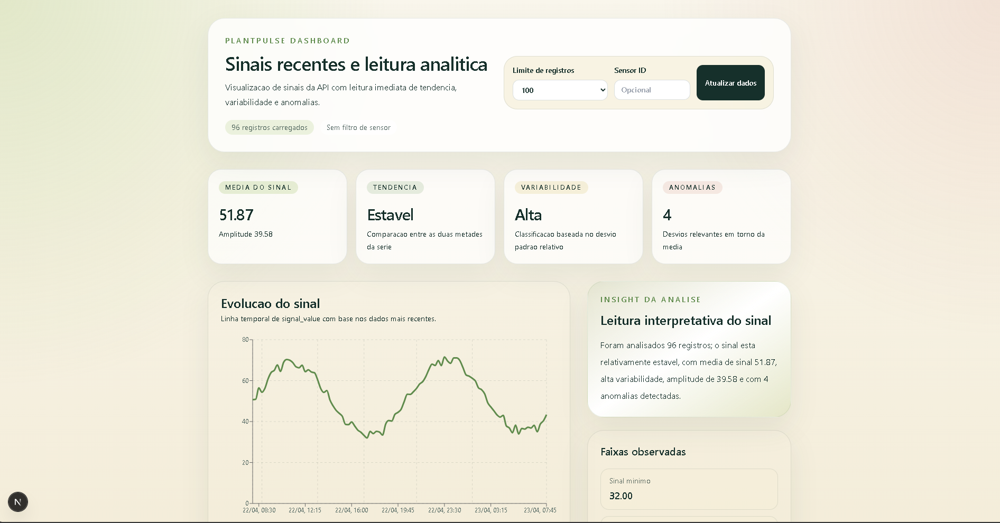
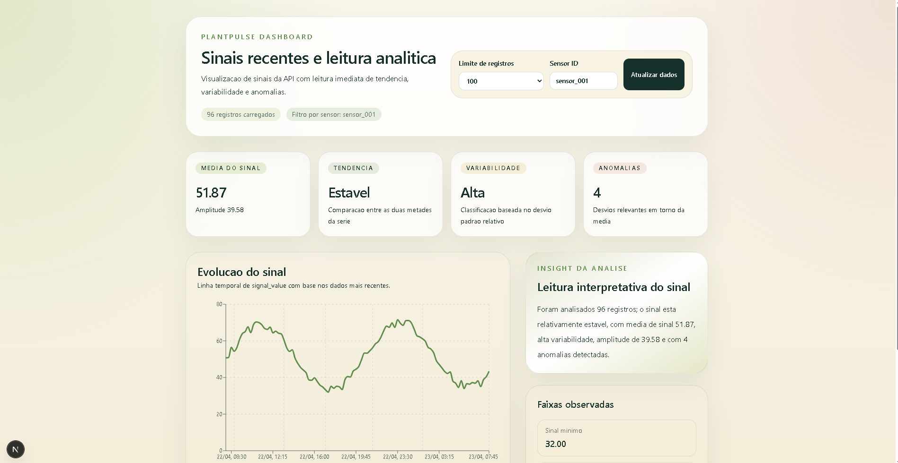

# PlantPulse

Sistema full-stack para simulação, persistência, análise e visualização de sinais de sensores de plantas.

## Demo

- Frontend: [https://plant-pulse-jmsp.vercel.app/dashboard](https://plant-pulse-jmsp.vercel.app/dashboard)
- API healthcheck: [https://plantpulse-backend-4nvd.onrender.com/api/v1/health](https://plantpulse-backend-4nvd.onrender.com/api/v1/health)

Ambiente publicado:

- Frontend hospedado na Vercel.
- Backend FastAPI hospedado no Render.
- Banco PostgreSQL hospedado no Neon.

## Demonstração

### Visão geral do dashboard



### Filtro por sensor



## Sobre o projeto

O PlantPulse demonstra um fluxo completo de dados aplicado ao contexto de monitoramento de plantas.

O projeto gera sinais simulados de sensores, exporta esses dados para CSV, importa os registros para PostgreSQL, expõe os dados por uma API FastAPI e apresenta as informações em um dashboard web construído com Next.js.

A proposta é manter uma base técnica clara, reproduzível e útil para portfólio, sem adicionar complexidade desnecessária.

O sistema cobre:

- simulação de sinais plausíveis ao longo do tempo
- persistência dos registros em PostgreSQL
- leitura dos dados via API REST
- análise estatística inicial
- visualização em dashboard com gráfico, métricas e resumo interpretativo

## Arquitetura

```text
PlantPulse/
|-- backend/
|   |-- app/                 # API FastAPI
|   |-- database/            # conexão e schema PostgreSQL
|   |-- data_processing/     # importação, leitura e análise
|   |-- sensor_simulation/   # geração de sinais simulados
|   |-- data/                # CSV gerado
|   |-- tests/               # testes do backend
|   `-- requirements.txt
|
|-- frontend/
|   |-- app/                 # rotas Next.js
|   |-- components/          # componentes do dashboard
|   |-- lib/                 # cliente da API
|   |-- package.json
|   `-- package-lock.json
|
|-- docs/                    # screenshots do projeto
`-- README.md
```

Fluxo principal da arquitetura:

```text
Simulação
    |
    v
CSV
    |
    v
PostgreSQL
    |
    v
API FastAPI
    |
    v
Dashboard Next.js
```

Em produção, esse fluxo usa Neon para o PostgreSQL, Render para a API e Vercel para o dashboard.

## Tecnologias

### Backend

- Python
- FastAPI
- PostgreSQL
- psycopg2
- python-dotenv
- pytest

### Frontend

- Next.js com App Router
- TypeScript
- TailwindCSS
- Recharts

### Deploy

- Render
- Vercel
- Neon

## Funcionalidades

- Geração de sinais simulados com padrão oscilatório, ruído leve e seed opcional.
- Exportação dos sinais para CSV compatível com o schema do banco.
- Importação em lote para PostgreSQL usando `executemany`.
- Proteção contra duplicidade por `sensor_id` e `signal_timestamp`.
- Leitura de sinais recentes com filtro opcional por sensor.
- Análise estatística com média, mínimo, máximo, amplitude, tendência, variabilidade e anomalias.
- API REST versionada em `/api/v1`.
- Healthcheck da API.
- Dashboard com gráfico temporal, cards de métricas, resumo analítico e filtros.
- Tratamento de estados de loading, erro e ausência de dados no frontend.

## Fluxo de dados

```text
Simulação -> CSV -> PostgreSQL -> API -> Dashboard
```

Etapas do fluxo local:

1. Criar o banco PostgreSQL.
2. Aplicar o schema da tabela `plant_signals`.
3. Gerar o CSV com sinais simulados.
4. Importar o CSV para o PostgreSQL.
5. Subir o backend FastAPI.
6. Subir o frontend Next.js.
7. Acessar o dashboard.

Durante a importação, registros duplicados com o mesmo `sensor_id` e `signal_timestamp` são ignorados pelo PostgreSQL.

## Como rodar o projeto

### 1. Criar banco PostgreSQL

Acesse o PostgreSQL e crie o banco:

```sql
CREATE DATABASE plantpulse;
```

A partir da pasta `backend`, aplique o schema:

```powershell
cd backend
psql -h localhost -U postgres -d plantpulse -f database/schema.sql
```

Se a tabela já existir sem a restrição de unicidade, aplique:

```sql
ALTER TABLE plant_signals
ADD CONSTRAINT plant_signals_sensor_timestamp_unique
UNIQUE (sensor_id, signal_timestamp);
```

### 2. Configurar e rodar o backend

Entre na pasta do backend:

```powershell
cd backend
```

Crie e ative o ambiente virtual:

```powershell
python -m venv .venv
.\.venv\Scripts\Activate.ps1
```

Instale as dependências:

```powershell
pip install -r requirements.txt
```

Crie o arquivo de ambiente:

```powershell
Copy-Item .env.example .env
```

Configure o `.env` com as credenciais do PostgreSQL:

```env
DB_HOST=localhost
DB_PORT=5432
DB_NAME=plantpulse
DB_USER=postgres
DB_PASSWORD=sua_senha
```

Gere o CSV simulado:

```powershell
python sensor_simulation/plant_signal_generator.py
```

Importe os dados para o banco:

```powershell
python data_processing/insert_data.py
```

Rode a API:

```powershell
uvicorn app.main:app --reload
```

Endpoints principais:

- `http://127.0.0.1:8000/api/v1/health`
- `http://127.0.0.1:8000/api/v1/signals?limit=100`
- `http://127.0.0.1:8000/api/v1/analysis?limit=100`
- `http://127.0.0.1:8000/docs`

### 3. Configurar e rodar o frontend

Em outro terminal, entre na pasta do frontend:

```powershell
cd frontend
```

Instale as dependências:

```powershell
npm install
```

O `package-lock.json` deve ser mantido no repositório para deixar a instalação mais reproduzível.

Crie o arquivo de ambiente:

```powershell
Copy-Item .env.local.example .env.local
```

Configure a URL da API:

```env
NEXT_PUBLIC_API_URL=http://127.0.0.1:8000/api/v1
```

Rode o dashboard:

```powershell
npm run dev
```

Acesse:

```text
http://localhost:3000/dashboard
```

## UX do dashboard

O dashboard foi pensado para ser direto, legível e funcional.

Ele inclui:

- seletor de limite com opções como 50, 100 e 200 registros
- filtro opcional por `sensor_id`
- botão para atualizar os dados manualmente
- gráfico de linha com `signal_value` ao longo do tempo
- cards com métricas principais da análise
- resumo textual em português com interpretação do comportamento do sinal
- estados de loading, erro e ausência de dados

A busca por `sensor_id` é aplicada ao clicar em `Atualizar dados`, evitando chamadas desnecessárias à API a cada tecla digitada.

## Observações

- O projeto está publicado com frontend na Vercel, backend no Render e banco PostgreSQL no Neon.
- O projeto não usa ORM; a comunicação com PostgreSQL é feita com `psycopg2`.
- A API possui CORS configurado para o ambiente local e para o domínio público da Vercel.
- A análise é estatística e interpretável, sem uso de IA ou machine learning.
- A proteção contra duplicatas depende da restrição única em `(sensor_id, signal_timestamp)`.
- Para tabelas com duplicatas já existentes, o `ALTER TABLE` de unicidade pode falhar até que os dados sejam corrigidos.
- O backend e o frontend ficam separados em pastas próprias para facilitar execução e manutenção.

## Próximos passos

- Adicionar testes automatizados para o frontend.
- Criar filtros por intervalo de datas.
- Melhorar comparação entre sensores.
- Adicionar monitoramento simples para disponibilidade da API.

## Status

Projeto funcional e publicado para portfólio técnico.

O fluxo completo está implementado: simulação de dados, CSV, importação em PostgreSQL, API versionada, banco em produção e dashboard web integrado.
